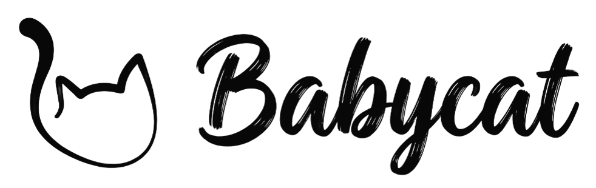

<picture>
  <source media="(prefers-color-scheme: dark)" srcset="./public/banner-dark-theme.png">
  <source media="(prefers-color-scheme: light)" srcset="./public/banner-light-theme.png">
  
</picture>

<p align="center">
  
  
  
  
  
</p>

# Mewly

`mewly` is the Android-oriented client project for a pet abnormal-behavior recognition flow backed by `babycat`.

The current baseline is a full copy of `../babycat/web/src`, adapted to run inside the `mewly` project. This keeps the existing `babycat` debugging dashboard contracts working first, before the UI is reshaped for mobile and Android.

## Project Relationship

- `../babycat` owns the edge-AI backend: RTSP camera input, VLM inference, event detection, clip recording, API, and streaming services.
- `../babycat/web` is a debugging and operations dashboard for `babycat`. It is not the final user app.
- `mewly` starts from the `babycat/web` contract baseline, then moves toward a mobile/Android client.
- `../wally` may provide UI and product-flow hints later, but `babycat` remains the source of truth for runtime API behavior.

## Current Baseline

The PC browser baseline has been checked against a running `babycat` stack:

- login through `POST /api/login`
- dashboard entry
- `babycat` API/App proxy routing through Vite
- copied `babycat/web` source and public assets
- production build with `npm run build`

The next planned step is a minimal Android build and real-device network check before large mobile UI changes.

## Development

Create or update `.env`:

```sh
cp .env.example .env
```

```env
HOST_IP=172.27.1.205
MEWLY_WEB_PORT=5177
```

`HOST_IP` should be reachable from the browser or Android device that will run `mewly`.

Run locally:

```sh
npm install
npm run dev -- --host 0.0.0.0
```

Open:

```text
http://<HOST_IP>:5177/
```

Docker development is also available:

```sh
docker compose up --build
```

## Babycat Routing

During Vite development, `mewly` uses proxy routes derived from `HOST_IP` or `VITE_BABYCAT_*` variables:

- `/api`, `/clips`, `/camera` -> `http://<HOST_IP>:8000`
- `/events`, `/prompt`, `/ptz`, `/vlm` -> `http://<HOST_IP>:8080`
- HLS -> `http://<HOST_IP>:8888/live/index.m3u8`
- WebRTC -> `http://<HOST_IP>:8889/live/whep`

Android builds do not rely on the Vite dev proxy in the same way. Verify Android networking before rewriting the UI.

## Android Check

The first Android goal is not mobile polish. It is to run the current copied UI on a device and verify:

- app launch
- login
- protected API calls such as `/camera` or `/clips`
- SSE connection
- HLS or WebRTC playback
- clip playback

Suggested commands:

```sh
npm run build
npx cap add android
npx cap sync android
npx cap open android
```

If `android/` already exists, inspect it before recreating it.

## Stack

- Vue 3
- Vite
- Vue Router
- hls.js
- Capacitor
- Docker Compose development container
